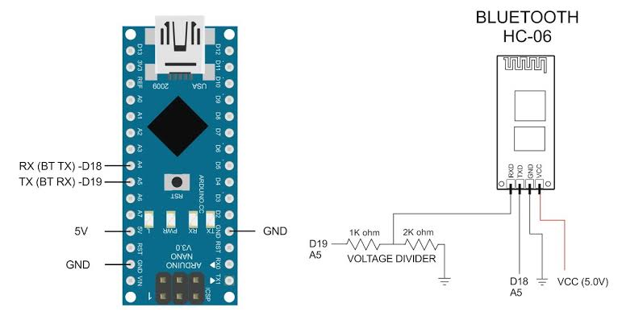

# HC-06 AT Command Programming

This Arduino code, named `HC_06_config.ino`, allows you to program the HC-06 Bluetooth module using AT commands. It establishes a communication link between the Arduino board and the HC-06 module, enabling you to send AT commands from the Arduino board to configure the module.

## Hardware Setup

To use this code, you need to connect the HC-06 Bluetooth module to your Arduino board. The connections are as follows:

- HC-06 RX (module receive) to Arduino pin 10 (software serial transmit)
- HC-06 TX (module transmit) to Arduino pin 11 (software serial receive)
- HC-06 VCC to Arduino 5V
- HC-06 GND to Arduino GND

## SoftwareSerial Library

This code utilizes the SoftwareSerial library to establish a software serial connection between the Arduino board and the HC-06 module. The library allows you to define a custom serial communication using any digital pins on the Arduino.

## Functionality

The code provides the following functionality:

- Establishes a serial communication with the HC-06 module and the USB-PC.
- Prints the command reference for AT commands supported by the HC-06 module.
- Reads data from the HC-06 module and prints it to the serial monitor (USB-PC).
- Reads data from the serial monitor (USB-PC) and sends it to the HC-06 module.
- Displays the HC-06 module's response on the serial monitor (USB-PC).

## Usage

1. Upload the `HC_06_config.ino` code to your Arduino board.
2. Open the serial monitor on the Arduino IDE or any other serial communication software.
3. Set the baud rate of the serial monitor to 9600 (or adjust it to match the configured baud rate of your HC-06 module).
4. Follow the command reference provided in the code's setup section to send AT commands to the HC-06 module.

    

## Command Reference

The following commands can be sent to the HC-06 module using the serial monitor:

- AT: Checks the connection between the Arduino board and the HC-06 module.
- AT+VERSION: Requests the firmware version of the HC-06 module.
- AT+NAME<name>: Changes the name of the HC-06 module to the specified `<name>`.
- AT+PIN<nnnn>: Changes the password of the HC-06 module to the specified 4-digit `<nnnn>`.
- AT+BAUD<n>: Changes the baud rate of the HC-06 module to the specified `<n>`. The available baud rates are:
  - BAUD1 = 1200
  - BAUD2 = 2400
  - BAUD3 = 4800
  - BAUD4 = 9600 (default)
  - BAUD5 = 19200
  - BAUD6 = 38400
  - BAUD7 = 57600
  - BAUD8 = 115200

Note: Replace `<name>` and `<nnnn>` in the commands with your desired values.

## License

This code is provided under an MIT License. Refer to the license file for more information.

## Author

- Prajwal Dutta
- GitHub: [SciNoLimits](https://github.com/SciNoLimits)
